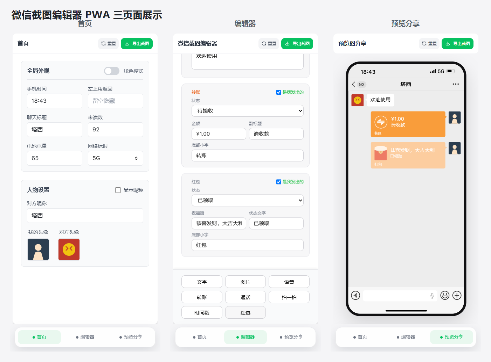

# 微信截图编辑器 PWA

一个无需构建即可运行的静态 Vue 3 PWA，用于编辑和导出仿微信聊天界面的 PNG。界面分为“首页 / 编辑器 / 预览分享”三页，可作为本地设计预览工具安装到主屏幕。

> 仅用于学习、演示和设计稿预览。请勿用于伪造证据、冒充他人或误导传播。仓库中的部分字体和仿微信/iOS 图片没有可核验的分发授权，公开发布前必须先处理 [素材来源与发布门禁](ASSET_PROVENANCE.md)。



## 当前功能

- 编辑浅色/深色主题、状态栏、聊天标题、未读数、网络和电量。
- 设置我的头像和三位对方的昵称、头像及昵称显示开关。
- 每条用户消息可从三位对方的真实昵称或“是我发出的”中选择发送人，群聊预览会匹配对应头像与昵称。
- 支持文字、图片、语音、转账、通话、拍一拍、时间戳和红包八类消息。
- 支持拖动手柄排序，并提供触屏友好的上移/下移按钮。
- 新上传图片会自动缩放压缩；轻量状态保存在 `localStorage`，图片二进制优先保存在 IndexedDB。
- 可导出/导入包含设置、消息和图片的 JSON 备份。
- 先生成一张 `1125 × 2436` PNG 供确认，再使用同一结果下载或调用系统文件分享。
- 支持 PWA Manifest、Service Worker 离线缓存和主屏幕安装。

## 项目结构

```text
.
├── index.html                 # 三页模板和静态入口
├── css/app.css                # 应用样式与本地字体声明
├── js/app.js                  # Vue 状态、存储、排序、备份和导出逻辑
├── manifest.webmanifest       # PWA 安装配置
├── sw.js                      # v31 核心资源缓存
├── vendor/                    # Vue、Tailwind CSS、html-to-image 本地副本
├── fonts/                     # 本地字体（公开分发前必须完成授权处理）
├── pic/                       # 仿微信/iOS UI 素材（公开分发前必须完成授权处理）
├── assets/                    # PWA 图标和展示图
├── tests/                     # 固定测试数据、视觉基线、手工与 E2E 回归
├── scripts/check-project.mjs  # 无构建静态一致性检查
├── PROJECT_STATUS.md          # 后续 AI/开发者接手入口
├── THIRD_PARTY_NOTICES.md     # 软件依赖版本、指纹和许可证状态
└── ASSET_PROVENANCE.md        # 字体、图片的来源缺口与发布门禁
```

## 本地运行

不要通过 `file://` 直接双击打开，Service Worker、字体和导出链路需要 HTTP 环境。

```bash
python -m http.server 8188
```

然后访问 `http://127.0.0.1:8188/`。

## 开发与测试

```bash
npm install
npx playwright install chromium
npm test
```

`npm test` 会先运行 140 项静态/资源/数据检查，再运行 5 项 Playwright Chromium 端到端测试。若 Windows PowerShell 的执行策略阻止 `npm.ps1`，可改用 `npm.cmd` 和 `npx.cmd`。

测试覆盖 v18→v19/schema 3 数据迁移、群聊发送人选择与持久化、三页导航、消息排序、390 px 移动布局、PNG 尺寸以及 JSON 备份下载。详细人工验证见 [tests/MANUAL_REGRESSION.md](tests/MANUAL_REGRESSION.md)。

## 数据与备份

- 当前状态键：`wechat_editor_state_v19`，schema 版本为 `3`。
- schema 3 使用固定的 `other1/other2/other3` 参与者和消息 `senderId`；旧单聊的对方资料与消息会自动映射到 `other1`。
- 首次读取旧键 `wechat_editor_state_v18` 时会迁移；只有新状态保存成功后才删除旧键。
- 图片优先写入 IndexedDB 数据库 `wechat_screenshot_pwa_assets`；localStorage 只保存资源 ID 和文本状态。
- 头像最长边压缩到 1024 px，消息图片最长边压缩到 1600 px。
- 导出备份会重新内联图片，便于跨浏览器恢复。
- 清理站点数据仍会删除本地状态和图片，重要内容应先导出备份。

## PWA 安装与缓存

生产环境应使用 HTTPS；`localhost`/`127.0.0.1` 仅适合开发。iOS Safari 可通过分享菜单“添加到主屏幕”，Android Chrome/Edge 可通过浏览器安装入口添加。

修改入口、样式、脚本、字体或图片后，应同步检查 `sw.js` 的 `CORE_ASSETS` 并提升 `CACHE_NAME`。当前缓存名为 `wechat-screenshot-pwa-v31`。

## Cloudflare Workers 部署

仓库已经提交 `wrangler.jsonc`，以项目根目录作为静态资源目录；`.assetsignore` 会排除 `node_modules`、Git、测试、脚本、报告和开发文档，避免把 Wrangler 自身的 `workerd` 二进制当作网页资源上传。

Cloudflare 的部署命令保持为：

```bash
npx wrangler deploy
```

不要删除 `.assetsignore` 中的 `node_modules/`。Cloudflare 构建阶段运行 `npm clean-install` 后会产生超过 Workers 单文件限制的开发二进制，但这些文件不属于 PWA 运行资源。

## 发布前门禁

- 在真实 iPhone Safari 和 Android Chrome 验证触摸排序、上传、下载/分享、安装、升级和离线启动。
- 解决 [ASSET_PROVENANCE.md](ASSET_PROVENANCE.md) 中所有 `BLOCKED` 项；当前仓库不应直接作为公开素材包分发。
- 保留 [THIRD_PARTY_NOTICES.md](THIRD_PARTY_NOTICES.md) 并为重新取得的第三方文件记录准确版本和来源。
- 运行 `npm test` 并确认工作树只包含预期改动。

更多实现状态、风险和接手规则见 [PROJECT_STATUS.md](PROJECT_STATUS.md)。
